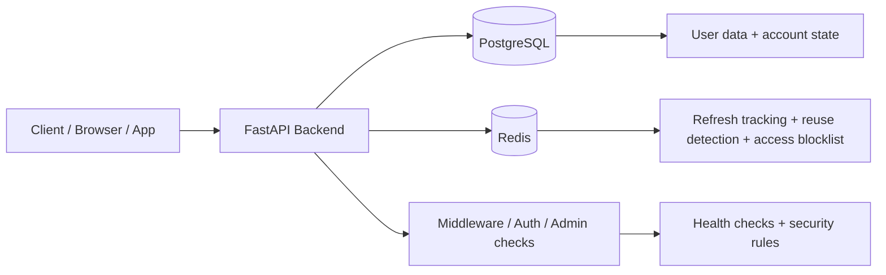
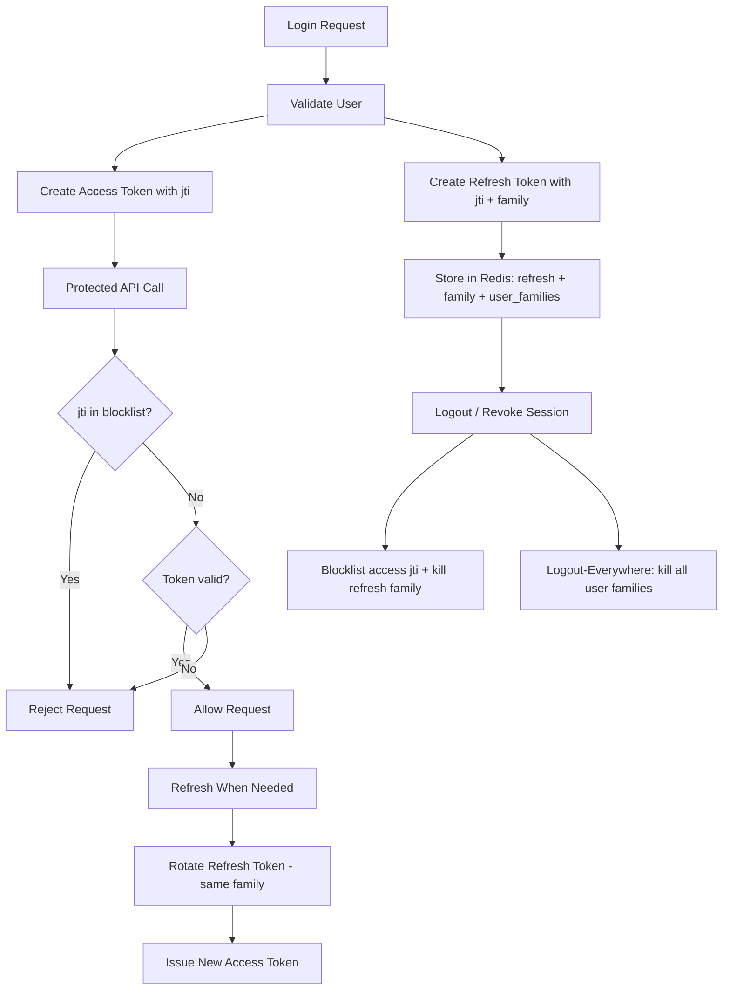
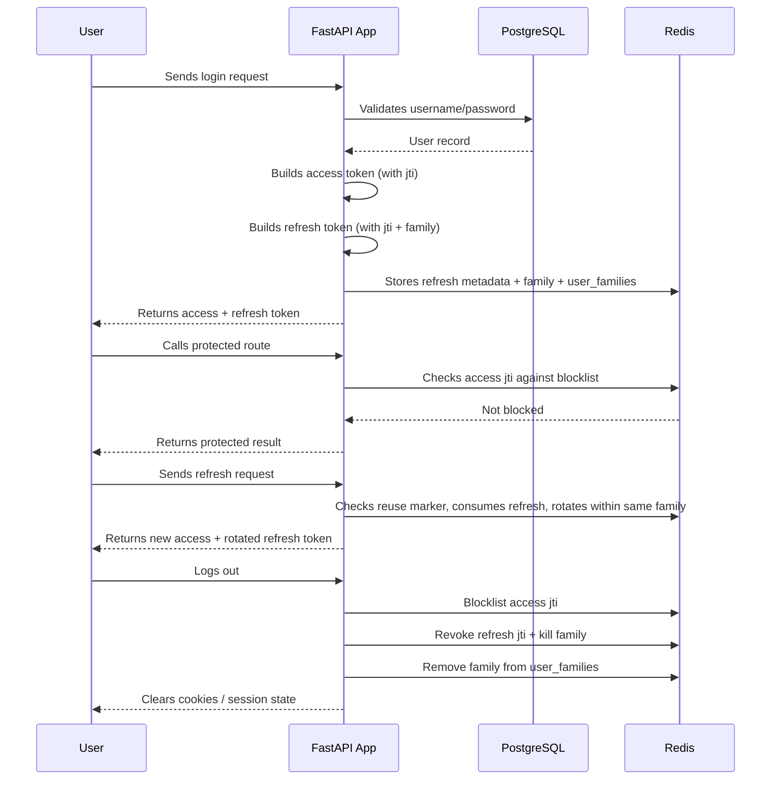

# API Boilerplate

<div align="center">
  
  
  
  
</div>

A clean FastAPI starter for login, user auth, Redis-backed refresh handling, and admin access control.

## Problem this solves

Most API boilerplates are either:

- too simple and leave out real auth, refresh flow, and session tracking
- too complex and feel like a research project instead of an app starter
- missing the operational basics: env config, health checks, Redis handling, and admin access control

This project is built to solve the real gap between "hello world API" and "production-ready starter".

It gives you a working backend shape for:

- secure login and signup
- short-lived access tokens + refresh token rotation
- Redis-based refresh tracking and reuse protection
- server-side access token blocklisting (immediate logout)
- server-side logout-everywhere (revoke all sessions for a user)
- admin-role checks
- structured startup, config, and health monitoring

### Why this is different from other boilerplates

Other boilerplates often stop at a basic CRUD API and ignore the most painful parts of real product auth.

This one is designed for the boring but important stuff that usually breaks in production:

- login works without custom glue code
- refresh tokens rotate safely
- access tokens can be revoked immediately on logout (not just waited out until expiry)
- every refresh token in a session family dies together — reuse detection actually propagates
- user sessions can be invalidated server-side, per-session or across all devices
- admin access is defined cleanly
- local development is easy to run with fake but realistic config



### Token lifecycle



---

## Quick overview

```text
Client App
    |
    v
FastAPI API
    |
    +--> PostgreSQL (users / account data)
    |
    +--> Redis (refresh token tracking + access token blocklist)
```

### Included features

- JWT access tokens (with `jti`) + refresh tokens (with `jti` + `family`)
- Redis-based refresh storage, rotation, and reuse detection
- Access token blocklisting — logout kills the access token immediately
- Family-level refresh revocation — one reuse kills the whole session lineage
- Logout-everywhere — revoke every refresh family for a user
- Cookie auth support
- Admin access checks
- Rate limiting and kill-switch middleware
- Health checks and structured logging

---

## Quick start

### 1) Install Python and create the environment

```bash
cd /mnt/talha_linux/talha/Documents/DEv/Python/API-Boiler-Plate
python3 -m venv .venv
source .venv/bin/activate
python -m pip install --upgrade pip
pip install -r requirements.txt
```

If you are using a different OS or shell, the same flow applies: create a virtualenv, activate it, and install dependencies from the requirements file.

### 2) Add the environment variables

Create a `.env` file in the project root. Use the example below with fake but realistic local values:

```env
# Security
SECRET_KEY=dev_secret_key_replace_before_production_123456
ALGORITHM=HS256

# Access tokens are short-lived. Refresh tokens keep the user logged in.
ACCESS_TOKEN_EXPIRE_MINUTES=15
REFRESH_TOKEN_TTL_SECONDS=604800

# PostgreSQL
DATABASE_HOST=127.0.0.1
DATABASE_PORT=5433
DATABASE_USER=Talha
DATABASE_PASSWORD=Talha6295
DATABASE_NAME=testdb
DATABASE_SCHEMA=public
DATABASE_POOL_SIZE=10
DATABASE_MAX_OVERFLOW=20
ASYNC_MODE=true

# Redis
REDIS_URL=redis://127.0.0.1:6379/0

# App
ENVIRONMENT=development
ALLOWED_ORIGINS=http://localhost:3000
COOKIE_SECURE=false
HTTPS_ONLY=false

# Rate limiting
RATE_LIMIT_DEFAULT=100/minute
KILL_SWITCH_ENABLED=false

# Logging
LOG_FILEPATH=./logs/

# Argon2
MEMORY_COST=65536
PARALLELISM=2
HASH_LENGTH=32
SALT_LENGTH=16

# Admin
ADMIN_USERNAME=admin
ADMIN_EMAIL=admin@example.com
ADMIN_PASSWORD=Admin@123
```

### 3) Start PostgreSQL and Redis

Make sure both services are running locally before you launch the app.

For local development, a typical setup is:

- PostgreSQL on `127.0.0.1:5433`
- Redis on `127.0.0.1:6379`

For Redis, enable persistence so the refresh tracking and blocklist survive a restart:

```bash
docker run -d --name redis -p 127.0.0.1:6379:6379 redis:8 --appendonly yes
```

If Redis is wiped or restarted without persistence, active refresh families and blocklisted access tokens are lost. `appendonly yes` prevents that.

### 4) Run the app

```bash
source .venv/bin/activate
uvicorn main:app --host 0.0.0.0 --port 2026 --reload
```

Open:

- Swagger UI: http://localhost:2026/docs
- OpenAPI: http://localhost:2026/openapi.json
- Health: http://localhost:2026/health

> For local dev, `COOKIE_SECURE=false` is okay. In production, use HTTPS and secure cookies.
> Disable `/docs` and `/openapi.json` in production.

---

## Default accounts

### Admin

```json
{
  "username": "admin",
  "password": "Admin@123"
}
```

### QA user

```json
{
  "username": "talha",
  "password": "Talha@1234567"
}
```

---

## Auth flow



### Simple version

- **Access token** — short-lived (15 min default), used for API calls, carries a `jti` so it can be blocklisted
- **Refresh token** — long-lived (7 days default), used to mint a new access token, carries a `jti` and a `family`
- **Redis** — tracks refresh tokens by `jti`, tracks which `jti`s belong to which `family`, tracks families per user, and holds the access-token blocklist
- **Logout** — blocklists the access `jti`, revokes the refresh `jti`, kills the entire refresh family, clears cookies
- **Logout-everywhere** — kills every refresh family the user currently has tracked in Redis

### What "family" means

Every login creates a new UUID called `family`. Every refresh rotation keeps the **same family** — the old refresh token is consumed, a new one is issued under the same `family`. If a client ever reuses an old (already consumed) refresh token, that's a reuse signal: the server kills **every token in the family**, so both the attacker's and the legit user's rotated tokens die at once. That's the guarantee that makes rotation worth doing.

### What "blocklist" means

Access tokens can't be un-issued — they're stateless JWTs. To make logout actually take effect on an access token that's still inside its `exp` window, logout writes `blocklist_at:{jti}` to Redis and every authenticated request checks it. Without this check, an access token stays valid until it naturally expires.

---

## Main routes

| Area | Endpoint | What it does |
| --- | --- | --- |
| Auth | `POST /app/v1/auth/basic_auth/login` | Login and issue tokens |
| Auth | `POST /app/v1/auth/basic_auth/signup` | Create a user |
| Auth | `POST /app/v1/auth/basic_auth/logout` | Blocklist access jti, revoke refresh family, clear cookies |
| User | `GET /app/v1/users/users_config/me` | Get current user |
| User | `POST /app/v1/users/users_config/refresh` | Rotate refresh token within the same family |
| Admin | `GET /app/v1/admin/admin_access/users` | Admin-only listing |
| System | `GET /health` | Health check |
| System | `GET /health/live` | Liveness |
| System | `GET /health/ready` | Readiness |

---

## Example requests

### Login

```bash
curl -X POST http://localhost:2026/app/v1/auth/basic_auth/login \
  -H 'Content-Type: application/json' \
  -d '{"username":"talha","password":"Talha@12345"}'
```

### Admin login

```bash
curl -X POST http://localhost:2026/app/v1/auth/basic_auth/login \
  -H 'Content-Type: application/json' \
  -d '{"username":"admin","password":"Admin@123"}'
```

### Cookie login

```bash
curl -X POST 'http://localhost:2026/app/v1/auth/basic_auth/login?cookie_login=true' \
  -H 'Content-Type: application/json' \
  -d '{"username":"talha","password":"Talha@1234567"}'
```

### Get profile

```bash
curl http://localhost:2026/app/v1/users/users_config/me \
  -H 'Authorization: Bearer <access_token>'
```

### Refresh token

```bash
curl -X POST http://localhost:2026/app/v1/users/users_config/refresh \
  -H 'Content-Type: application/json' \
  -d '{"refresh_token":"<refresh_token>"}'
```

### Logout (Bearer — both tokens)

```bash
curl -X POST http://localhost:2026/app/v1/auth/basic_auth/logout \
  -H 'Content-Type: application/json' \
  -H 'Authorization: Bearer <access_token>' \
  -d '{"refresh_token":"<refresh_token>"}'
```

After this, reusing either token returns 401. The access token is blocked via `blocklist_at:{jti}`; the refresh token's entire family is killed.

---

## Redis and security notes

Redis is used for:

- **refresh token storage** — `refresh:{jti}` → `{user_id, family_id}`
- **family membership** — `refresh_family:{family_id}` → set of `jti`s
- **per-user family index** — `user_families:{user_id}` → set of `family_id`s
- **reuse detection** — `revoked_rt:{jti}` written on consume or revoke
- **access token blocklist** — `blocklist_at:{jti}` written on logout
- **login rate limiting** — `login_attempts:{email}:{ip}`
- **HTTP rate limiting** — `rl:{ip}:{method}:{path}:{bucket}`
- **kill switch state** — `kill_switch:auto_kill_until`

Make sure Redis is running **and persistent** (`appendonly yes`) before using login or refresh flows. If Redis is wiped, refresh families and the blocklist are lost.

Security notes:

- password hashing uses Argon2
- JWT signing uses `SECRET_KEY`
- access tokens are short-lived (default 15 min) to bound exposure
- refresh tokens rotate on every use and detect reuse
- cookies should be `Secure` in production
- use HTTPS in production
- restrict allowed origins
- bind Redis to a private interface and set `requirepass` in production
- disable `/docs`, `/redoc`, and `/openapi.json` in production

---

## Project structure

```text
API-Boiler-Plate/
├── App/
│   ├── api/
│   ├── core/
│   │   ├── token_store.py       # refresh + blocklist + user-family tracking
│   │   ├── redis_keys.py        # key naming helpers
│   │   ├── settings.py          # pydantic-settings config
│   │   ├── RedisConnector.py
│   │   └── Connector.py         # Postgres pool + session
│   ├── middleware/
│   ├── models/
│   ├── repository/
│   └── schemas/
├── docs/
├── logs/
├── test/
├── .env
├── main.py
├── docker-compose.yml
├── Dockerfile
├── README.md
├── requirements.txt
├── postman_collection.json
├── qa_report.json
└── alembic.ini
```

---

## Production notes

- replace placeholder secrets before deployment
- keep `COOKIE_SECURE=true` behind HTTPS
- keep access tokens short-lived (`ACCESS_TOKEN_EXPIRE_MINUTES=15`)
- run Redis with `appendonly yes` and a password
- set `DATABASE_PASSWORD` to a strong value
- disable `/docs`, `/redoc`, `/openapi.json` in production
- restrict `ALLOWED_ORIGINS` to real domains
- add smoke tests before shipping app changes

---

## Troubleshooting

### App fails to start

Check:

- `.env` exists
- PostgreSQL is running
- Redis is running
- required Python packages are installed

### Auth or JWT issues

Check:

- `SECRET_KEY` is valid
- tokens are not expired
- refresh token is valid
- Redis is reachable
- if a token returns 401 immediately after logout, that is expected — the access `jti` is blocklisted

### 503 on login

Login writes refresh metadata to Redis. If Redis is unreachable, login returns **503** (fail-closed). Check:

```bash
redis-cli ping
```

Expected output:

```bash
PONG
```

If `PONG` doesn't come back, start Redis. If it does come back but login still 503s, check the app logs — the traceback names the real cause (which may be a missing config field, not Redis itself).

---

## Final note

This project is a solid starting point for a real API with structured auth, admin role controls, and Redis-backed token handling — including immediate access-token revocation and family-wide refresh revocation, which most boilerplates skip.

Private project: `iotNoob` by Talha.