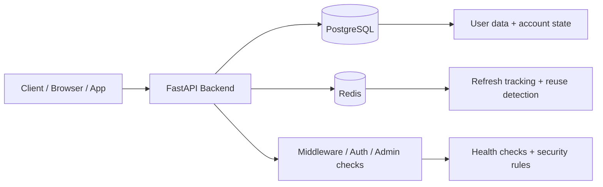
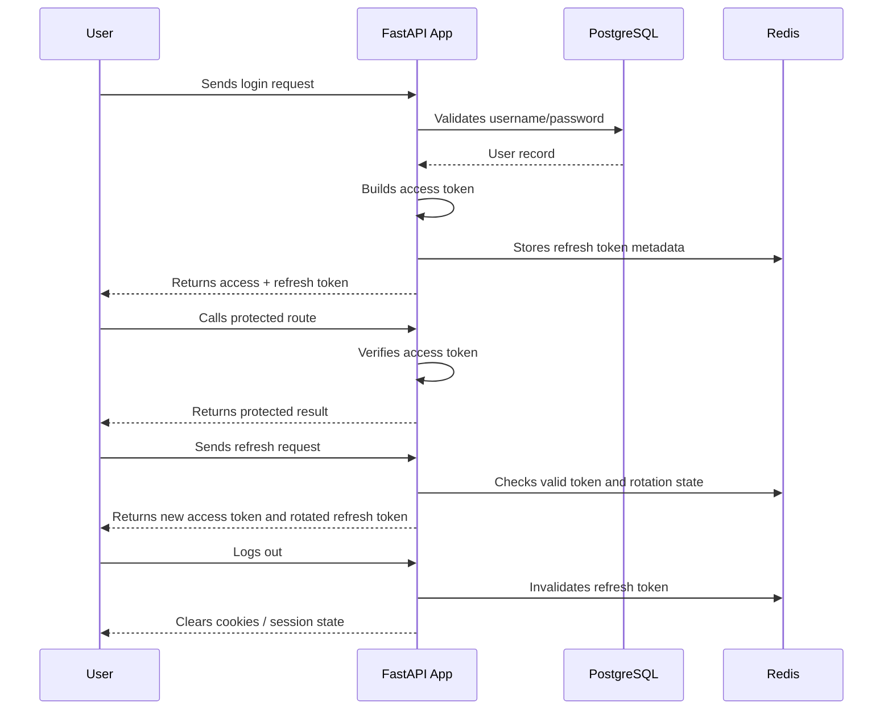

# API Boilerplate

<div align="center">
  
  
  
  
</div>

A clean FastAPI starter for login, user auth, Redis-backed refresh handling, and admin access control.

## Problem this solves

Most API boilerplates are either:

- too simple and leave out real auth, refresh flow, and session tracking
- too complex and feel like a research project instead of an app starter
- missing the operational basics: env config, health checks, Redis handling, and admin access control

This project is built to solve the real gap between "hello world API" and "production-ready starter".

It gives you a working backend shape for:

- secure login and signup
- short-lived access tokens + refresh token rotation
- Redis-based refresh tracking and reuse protection
- admin-role checks
- structured startup, config, and health monitoring

### Why this is different from other boilerplates

Other boilerplates often stop at a basic CRUD API and ignore the most painful parts of real product auth.

This one is designed for the boring but important stuff that usually breaks in production:

- login works without custom glue code
- refresh tokens rotate safely
- user sessions can be invalidated server-side
- admin access is defined cleanly
- local development is easy to run with fake but realistic config



---

## Quick overview

```text
Client App
    |
    v
FastAPI API
    |
    +--> PostgreSQL (users / account data)
    |
    +--> Redis (refresh token tracking)
```

### Included features

- JWT access tokens + refresh tokens
- Redis-based refresh storage and rotation
- Cookie auth support
- Admin access checks
- Rate limiting and kill-switch middleware
- Health checks and structured logging

---

## Quick start

### 1) Install Python and create the environment

```bash
cd /mnt/talha_linux/talha/Documents/DEv/Python/API-Boiler-Plate
python3 -m venv .venv
source .venv/bin/activate
python -m pip install --upgrade pip
pip install -r requiremets.txt
```

If you are using a different OS or shell, the same flow applies: create a virtualenv, activate it, and install dependencies from the requirements file.

### 2) Add the environment variables

Create a `.env` file in the project root. Use the example below with fake but realistic local values:

```env
# Security
SECRET_KEY=dev_secret_key_replace_before_production_123456
ALGORITHM=HS256
ACCESS_TOKEN_EXPIRE_MINUTES=790

# PostgreSQL
DATABASE_HOST=127.0.0.1
DATABASE_PORT=5433
DATABASE_USER=Talha
DATABASE_PASSWORD=Talha6295
DATABASE_NAME=testdb
DATABASE_SCHEMA=public
DATABASE_POOL_SIZE=10
DATABASE_MAX_OVERFLOW=20
ASYNC_MODE=true

# Redis
REDIS_URL=redis://127.0.0.1:6379/0

# App
ENVIRONMENT=development
ALLOWED_ORIGINS=http://localhost:3000
COOKIE_SECURE=false
HTTPS_ONLY=false

# Rate limiting
RATE_LIMIT_DEFAULT=100/minute
KILL_SWITCH_ENABLED=false

# Logging
LOG_FILEPATH=./logs/

# Argon2
MEMORY_COST=65536
PARALLELISM=2
HASH_LENGTH=32
SALT_LENGTH=16

# Admin
ADMIN_USERNAME=admin
ADMIN_EMAIL=admin@example.com
ADMIN_PASSWORD=Admin@123
```

### 3) Start PostgreSQL and Redis

Make sure both services are running locally before you launch the app.

For local development, a typical setup is:

- PostgreSQL on `127.0.0.1:5433`
- Redis on `127.0.0.1:6379`

### 4) Run the app

```bash
source .venv/bin/activate
uvicorn main:app --host 0.0.0.0 --port 2026 --reload
```

Open:

- Swagger UI: http://localhost:2026/docs
- OpenAPI: http://localhost:2026/openapi.json
- Health: http://localhost:2026/health

> For local dev, `COOKIE_SECURE=false` is okay. In production, use HTTPS and secure cookies.

---

## Default accounts

### Admin

```json
{
  "username": "admin",
  "password": "Admin@123"
}
```

### QA user

```json
{
  "username": "talha",
  "password": "Talha@6295"
}
```

---

## Auth flow



### Simple version

- Access token: short-lived, used for API calls
- Refresh token: longer-lived, used to mint a new access token
- Redis: tracks refresh tokens and helps detect reuse
- Logout: revokes refresh token and clears cookies

This is the standard flow used by most real web apps because it keeps access tokens short-lived while refresh tokens handle session renewal safely.

---

## Main routes

| Area | Endpoint | What it does |
| --- | --- | --- |
| Auth | `POST /app/v1/auth/basic_auth/login` | Login and issue tokens |
| Auth | `POST /app/v1/auth/basic_auth/signup` | Create a user |
| Auth | `POST /app/v1/auth/basic_auth/logout` | Revoke refresh token and clear cookies |
| User | `GET /app/v1/users/users_config/me` | Get current user |
| User | `POST /app/v1/users/users_config/refresh` | Rotate refresh token |
| Admin | `GET /app/v1/admin/admin_access/users` | Admin-only listing |
| System | `GET /health` | Health check |
| System | `GET /health/live` | Liveness |
| System | `GET /health/ready` | Readiness |

---

## Example requests

### Login

```bash
curl -X POST http://localhost:2026/app/v1/auth/basic_auth/login \
  -H 'Content-Type: application/json' \
  -d '{"username":"talha","password":"Talha@6295"}'
```

### Admin login

```bash
curl -X POST http://localhost:2026/app/v1/auth/basic_auth/login \
  -H 'Content-Type: application/json' \
  -d '{"username":"admin","password":"Admin@123"}'
```

### Cookie login

```bash
curl -X POST 'http://localhost:2026/app/v1/auth/basic_auth/login?cookie_login=true' \
  -H 'Content-Type: application/json' \
  -d '{"username":"talha","password":"Talha@6295"}'
```

### Get profile

```bash
curl http://localhost:2026/app/v1/users/users_config/me \
  -H 'Authorization: Bearer <access_token>'
```

### Refresh token

```bash
curl -X POST http://localhost:2026/app/v1/users/users_config/refresh \
  -H 'Content-Type: application/json' \
  -d '{"refresh_token":"<refresh_token>"}'
```

---

## Redis and security notes

Redis is used for:

- refresh token storage
- refresh token reuse detection
- token family invalidation
- session cancellation

Make sure Redis is running before using login or refresh flows.

Security notes:

- password hashing uses Argon2
- JWT signing uses `SECRET_KEY`
- cookies should be `Secure` in production
- use HTTPS in production
- restrict allowed origins

---

## Project structure

```text
API-Boiler-Plate/
├── App/
│   ├── api/
│   ├── core/
│   ├── middleware/
│   ├── models/
│   ├── repository/
│   └── schemas/
├── docs/
├── logs/
├── test/
├── .env
├── main.py
├── docker-compose.yml
├── Dockerfile
├── README.md
├── requiremets.txt
├── postman_collection.json
├── qa_report.json
└── alembic.ini
```

---

## Production notes

- replace placeholder secrets before deployment
- keep `COOKIE_SECURE=true` behind HTTPS
- prefer short-lived access tokens and rotated refresh tokens
- add smoke tests before shipping app changes

---

## Troubleshooting

### App fails to start

Check:

- `.env` exists
- PostgreSQL is running
- Redis is running
- required Python packages are installed

### Auth or JWT issues

Check:

- `SECRET_KEY` is valid
- tokens are not expired
- refresh token is valid
- Redis is reachable

### Redis issues

```bash
redis-cli ping
```

Expected output:

```bash
PONG
```

---

## Final note

This project is a solid starting point for a real API with structured auth, admin role controls, and Redis-backed token handling.

If you want to make it cleaner for public use, the best next step is to simplify the auth surface and keep only the essential flows you actually need.

Private project: `iotNoob` by Talha.
